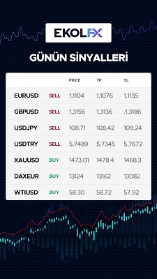

2019 yılına kadar bir çok yerli ve yabancı yurt dışı forex firmalarını denedim. 
Şu zamana kadar en başarılısı yurt dışı olup tam Türkiye destekli FX firması olan EkolFX. 

[[toc]]

::: tip KAYIT

<!-- [**Şu linkten kayıt olabilirsiniz**](https://www.ekolfx5.com/hesap-ac?ref=1959&utm_source=refout&utm_term=1959)> -->

:::

Neden mi? Benim en çok sevdiğim ve kullandığım özellikler;

### **1. Her Yatırıma %40 bonus**
En az ilk hesap açılışı 100 USD karşılığı TL banka kanalı ile iletecekleri hesaba göndererek olmaktadır. Örneğin 100 USD karşılığı TL'yi Türkiye'deki banka üzerinden gönderdiniz. Hesap açıldıktan sonra Meta Trader üzerinden Hesabınıza baktığınızda Depozit (Balance) kısmında 100, Credit (Kredi) kısmında 40 yazar.  Toplam bakiyeniz 140 olur. 

Bunun en büyük artısı işlem yaparken ki rahatlığınız. Dezavantajı para cekmek istediğinizde hesabınızdaki 140 USD'nin üstündeki tutarını cekebilirsiniz.

### **2. Swapsız Hesap Açma İmkanı**
Swap, kelime anlamı olarak “değiş, tokuş, takas” anlamına gelir. Finans piyasalarında ise; iki tarafın belirli bir zaman dilimi içinde bir varlık ya da yükümlülüğe bağlı olarak farklı faiz ödemelerini veya döviz cinsini karşılıklı olarak değiştirdikleri bir takas sözleşmesidir.

Her ne kadar ProFX anlık sinyal verse de o işleminin kapanması zaman alabiliyor. Bazen sinyal verdikten kısa süre sonra işlemde ters sinyal verebilir. Bundan dolayı eğer hesabınız swaplı ise bazen kazancınız gidebilir ve sizi eksi bakiyeye götürebilir. Aşağıda linkini verdiğim sayfadan EkolFX'in hesap türleri hakkında bilgi alabilirsiniz.

[EkolFX Hesap Türleri](https://www.ekolfx5.com/accounts)

### **3. Spot Piyasadan İşlem Yapması**
Bir çok FX firması DAX, Petrol gibi ürünlerde vadeli kontratlar ile çalışıyor. Buda bir anda çok kazanıp veya kaybetmenize neden oluyor. EkolFX'in en çok sevdiğim yanı spot yani işlem gördüğü gerçek fiyat üzerinden işlem yapması. 

Bu sayede gönül rahatlığı ile uzun süreli DAX, Petrol gibi ürünlerde işlem yapmanızı kolaylaştırıyor. En önemlisi Trend yönünü bldiğin üründe bekleyerek yüksek getiriyi sağlaması.

### **4. Türkiye'de Yaygın Banka Ağı**
EFT üçreti ödemeden havale ile para yatırma imkanı sunuyor. Buna ek olarak hesabınız riske girdiğinde değişik hızlı para yatırma alternatifleride sunmaktalar.

### **5. Günün Her Saati Para Çekme**
Mesai saatinde müşteri temsilciniz üzerinden Mesai saatleri sonrasında hafta içi 0 850 241 18 70 numaralı telefonu arayarak para cekim talebinizi iletebilirsiniz. Hafta sonları ise web sitesindeki canlı destek bölümündeki personele ileterek cekim sağlayabiliyorsunuz.
 
### **6. Günlük Sinyal**
Yerli ve Yabancı bir FX firmasında olmayan sinyal gönderimi EkolFX'de var. Sabah saat 9:30 - 10:00 arası Whatsapp üzerinden günlük sinyal gönderilmekte. Bunun yanında gün içi olası durumlarda alternatif sinyal gönderimi yapılıyor. Örnek Sinyal mesajına ait görüntü 

 
### **7. Düşük Spread**
Spread; Bir döviz kurunun alış fiyatı ile satış fiyatı arasındaki farkı ifade eder. Forex piyasasında yatırım yapan yatırımcı, işlem yaptığı döviz kurunu tek bir fiyattan alıp satmaz. İlgili döviz kuru için piyasada bir alış fiyatı, bir de satış fiyatı vardır. Yatırımcının işlem yaparken ödediği alış-satış fiyatı arasındaki fark olan işlem maliyetine spread denir. 

Aşağıda EkolFX'in her bir ürün için aldığı sabit spread değeri bulunmaktadır. Buna ek olarak hesap büyüklüğünüze göre ***her bir işlem için ödediğiniz komisyon bulunmaktadır.***

[EkolFX Spread Degerleri](https://www.ekolfx5.com/spread)

### **8. Web Portalı**
Ben en çok Ne zaman hangi kurdan para gönderip para çektiğimi görmek için kullanıyorum. 

### **9. SMS ile Bilgilendirme**
SMS ile Şifre değişikliği, para cekme - yatırma, günlük sinyal gibi bir çok bilgilendrimeyi almaktasınız.

[[toc]]

::: tip KAYIT

<!-- [**Şu linkten kayıt olabilirsiniz**](https://www.ekolfx5.com/hesap-ac?ref=1959&utm_source=refout&utm_term=1959) -->

:::
