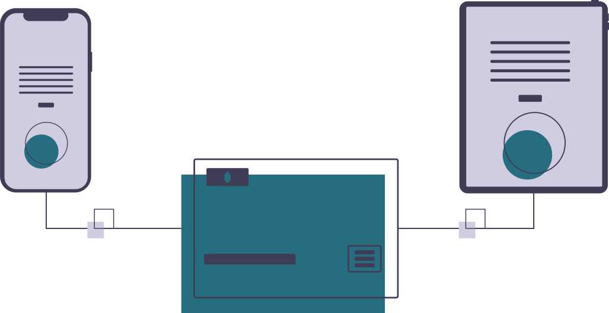

# KARŞILAŞABİLECEĞİNİZ PROBLEMLER

[[toc]]

## Kurulum Sonrası Sell - Buy Butonları Gözükmüyor

Lisanslama problemini göstermektedir. Öncelikle Chrome gibi her hangi bir web browser üzerinden forex21.com adresine gitmeyi deneyiniz. Eğer gidemez iseniz firewall (güvenlik duvarından) izin vermeyi eğer sorun çözülmez ise DNS sunucusu olarak 8.8.8.8 olarak yapıp bir daha deneyiniz.

Eğer Browser üzerinden erişebiliyorsanız Meta Trader üzerindeki Tools (Araçlar) >> Options (Seçenekler) >> Expert Advisors (Otomatik Alım Satım)  altına https://forex21.com adresi eklenmemiş olabilir.

Eğer tüm bunlar tamam ise Meta Trader uygulamasının sol üst taraftaki Yıldızlı Klasöre basın. Sonra açılan menüden Scripts tabı altındaki "Account Utility Tool" u çift tıklayıp açılan ekrandaki bilgileri support@forex21.com adresine mail atınız.

## Grafik ekran üzerinden Sell (Satım) - Buy (Alım) butonlarına basıyorum işlem yapmıyor
Bu problemin 2 ihtimali var:
Birincisi Meta Trader uygulaması üzerindeki AutoTrader (OtomatikAlımSatım) kırmızıdır. Aktif yapmak için butona basınız.

ikinci ihtimal ise her bir ürün en fazla girilecek işlem adedini aşmışsınızdır. Bunun konrolü için işlem yapamadığınız ürünün grafik ekran üzerinde sağ tıklayıp 
