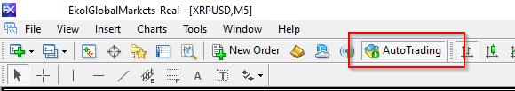

# KARŞILAŞABİLECEĞİNİZ PROBLEMLER

[[toc]]

## Kurulum Sonrası Sell - Buy Butonları Gözükmüyor

Lisanslama problemini göstermektedir. 

### Web browser üzerinden Forex21'e erişi biliyor mu?
Öncelikle Firefox gibi her hangi bir web browser üzerinden forex21.com adresine gitmeyi deneyiniz. Eğer gidemez iseniz firewall (güvenlik duvarından) izin vermeyi eğer sorun çözülmez ise DNS sunucusu olarak 8.8.8.8 olarak yapıp bir daha deneyiniz.

### MT'ye Forex21'e erişim izni verdiniz mi?
Eğer Browser üzerinden erişebiliyorsanız Meta Trader üzerindeki Tools (Araçlar) >> Options (Seçenekler) >> Expert Advisors (Otomatik Alım Satım)  altına ***https://forex21.com*** adresi eklenmemiş olabilir. Eğer yoksa klavye üzerinden Ctrl ile O (Ordunun O'su) tuşuna birlikte basın. Açılan ekranda Exper Advisons (Uzman Danışmanlar) menüsüne giriniz. Aşağıdaki gibi Allow (izin ver) yazanları tıklayın. Disable (Devre dışı) yazanlardan işareti kaldırın.

ProFX'in açılırken Lisans doğrulaması yapabilmesi için Web Request yazan kısıma aşağıdaki adresleri ekleyin.
https://forex21.com

https://www.forex21.com

https://secure.forex21.com

### Forex21'e Meta bilgilerini ilettiniz mi?
Eğer tüm bunlar tamam ise Meta Trader uygulamasının sol üst taraftaki Yıldızlı Klasöre basın. Sonra açılan menüden Scripts tabı altındaki "Account Utility Tool" u çift tıklayıp açılan ekrandaki bilgileri support@forex21.com adresine mail atınız.

## Grafik ekran üzerinden Sell (Satım) - Buy (Alım) butonlarına basıyorum işlem yapmıyor
**Bu problemin 2 ihtimali var:**

### a. AutoTrading Açık mı?
Meta Trader uygulaması üzerindeki AutoTrader (OtomatikAlımSatım) kırmızıdır. Aktif yapmak için butona basınız.

### b. EA İşlem limiti kısıtlı mı?
her bir ürün en fazla girilecek işlem adedini aşmışsınızdır. Bunun konrolü için işlem yapamadığınız ürünün grafik ekran üzerinde iken klavyeden F7 tuşuna veya sağ tıklayıp açılan ekranda "Expert Advisors" (Uzman Danışmanlar) menüsü altındaki Properties (Özellikler) tıklayın. Açılan ekranda "max Sell/Buy Order" kısmındaki değer 10 değil ise 10 yapınız. Bu kısım aynı anda ilgili üründen açık olabilecek en fazla işlem sayısını gösterir. Eğer burada 10 yazıyorsa gerçekten bu üründeki açık işlem sayısı 10'dan az ise support@forex21.com'a bilgi veriniz.

