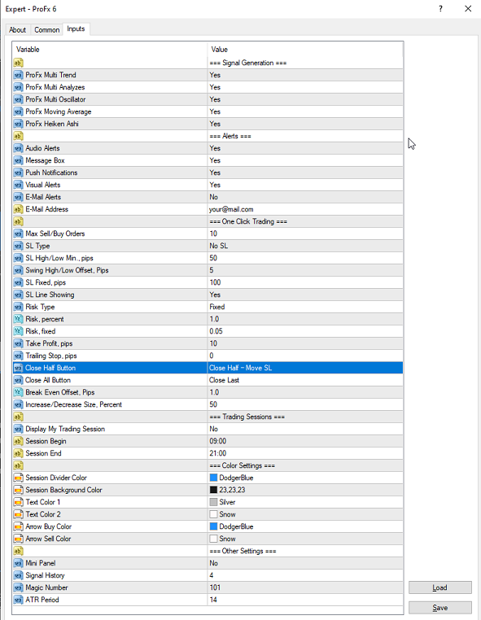

# BUY ve SELL Butonlarının Ayarlanması

[***Kurulum***](./ProFX/ProFXKurulumu) sayfasında gerekli ayarları yaptıktan ve Forex21'den lisans tanımları yapıldı ise artık sinyal üretmeye başlayacaktır. 

Bu sayfada grafik ekran üzerindeki SELL ve BUY butonlarının kullanımı için gerekli ayarların nasıl yapılacağı anlatılacaktır. Butonların ayarlanması için grafik ekran üzerinde F7 tuşuna basın veya Meta Trader üzerinde Charts (Grafik) > Template > Profx 6 - Standard tıklayın.

## ProFX EA Common Ayarları

Açılacak olan ekranda önce Common tabina gelip anlatıma başlayalım

Common tabı altında hangi yönde işleme gireceğinizi belirtiyorsunuz. Long demek Alış (BUY), Short ise Satış (SELL)'i ifade etmektedir. Çift taraflı yani hem Alış yönünde hem de satış yönünde işlemlere girmek için long&short'u seciniz. 

Grafik ekran üzerinde oluşan sinyallerin Windows bildirim mesajı olarak görüntülenmesi için "Enable Alerts" kutucuğu işaretlenir.

ProFX'in yeni sürüm güncellemesi sonrasında her bir grafik için ayrı ayrı işlem yapmamak için Safety tabı altındaki Allow kutucuklarını işaretleyiniz.

## ProFX EA inputs Ayarları
Açılan ekranda inputs tabına giriniz. Burası ProFX'in asıl ayarlar bölümü. 

### Daha önce oluşturulmuş ayarların yüklenmesi
Daha önceden ilgili grafik için elinizde set uzantılı dosya varsa ***Load*** butonuna basarak yükleyebilirsiniz. Eğer yaptığınız ayarları dosya olarak kaydetmek istiyorsanız ***Save*** butonuna basınız.

Aşağıda linkini verdiğim alandan benim kullandığım ayarları kendi bilgisayarınıza indirebilirsiniz. 

[Presents](/Presents)

### En Çok Kullanılan Ayarlar
Şimdi burada en çok kullanılanları size anlatacağım.
