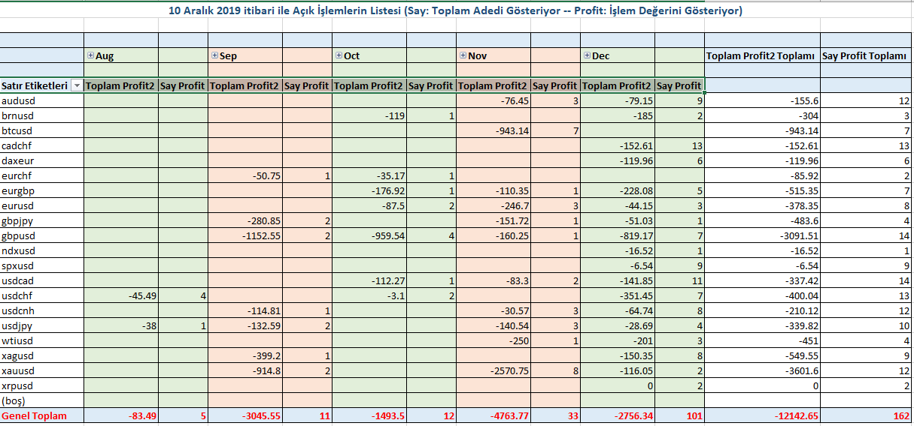

[[toc]]

# ProFX Başarısı

2016 yılından beri Forex'te yatırım yapmaktayım. 5 kere hesabım sıfırlandı. 2019 başında bir arkadaşımın vesilesi ile Alman menşeli  [**Forex21**](http://ahmetmusakosali.forex21pro3.c2strack.com)  firmasına ait [ ***ProFX***](http://ahmetmusakosali.forex21pro3.c2strack.com) Meta Trader 4 için yazılmış sinyal template'i ile tanıştım. 2019 Ağustos ayında ProFX ile başladığım işlemler sayesinde yıl sonu gelmeden zararımı cıkartıp artıya geçtim. 

## Ne Kadar Yatırdım Ne Kadar Kazandım?

Bu sayfada basit bir şekilde bu işe ne kadar yatırdığımı ve getirisini sunmaktayım. 

http://www.myfxbook.com/members/kazanmaninyolu/kazanmaninyolu/3941362

## Ne Kadar Zararım Var?

işlemden çıkmadığım sürece açık işlemleri zarar olarak değerlendirmek doğru olmayacağını düşünüyorum. Çünkü her an her şey olup tersine dönebilir. Bu yüzden ben pozisyonu taşımayı tercih ediyorum. Elbette bunun bir maliyeti var. Bu yüzden swapsız hesap açtım ve teminat seviyemi hep boş bırakıyorum.

0,01 lik işlemde 1 USD kazancak şekilde Take Profit (Kar Al) ayarlayıp Stop Lost (Zarar Kes) yapmadan işleme girmekteyim. Teminat seviyeniz müsait olduğu ve beklemeye razı olduğunuz sürece bir süre içinde işlem kar ile kapanıyor. Aşağıdaki tabloda 10 Aralık tarihi itibaren elimde açıkta olan işlemlerin detayını görmektesiniz. 

## Hatalarım Neler?

Bu kadar çok açık işlemimin olmasının 2 sebebi var. 
a) Para kazandıkça hırslanmak
b) Her sinyal yandığında "açıkta bu sinyalde işlemim var mı?" diye kontrol etmemek