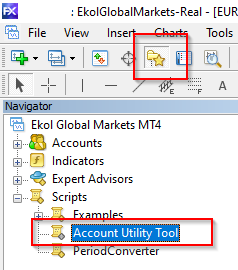
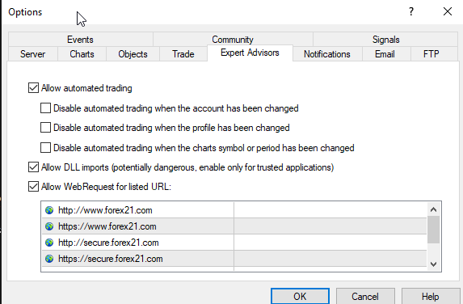

[[toc]]

# PROFX NASIL KURULUR

 Kredi Kart ile satın alımda verdiğiniz mail adresine güncel sürüm ve kurulum dökümanları gönderilecektir. 
 
 >> Eğer mail gelmeden Kuruluma başlayıp süreci hızlandırmak isterseniz Aşağıdaki linkte 6.3 sürümünü indirip kuruluma başlayabilirsiniz.
 
 [ProFX 6.3 Setup Dosyası](/profx_6_3.zip)

 ***Not:*** Mail ile Güncel sürüm geldiğinde dosyaları güncel sürüm ile değişimini unutmayınız.

## 1. MT Data Klasörünün Açılması
ProFX'in çalışabilmesi için Meta Trader'in (MT) çalıştığı alana kopyalanması lazım. Bunun için öncelikle Meta Trader 4 Uygulaması üzerinde sol üst köşedeki File / Dosya tabına tıklayın. Açılan menüden "Open Data Folder" tıklayarak MT'nin çalıştığı klasörü açınız.

## 2. Dosyaların MT Eklenmesi
Setup dosyası içinden çıkan tüm dosyaları açtığınız Meta Trader Data klasörü içindeki aynı klasörün içine kopyalayınız.

## 3. Meta Bilgisinin Forex21'e Gönderilmesi
ProFX, Meta Trader 4 Grafik ekranı üzerinde ve Grafik ekran açık kaldıkça çalışan ücretli ve özel indicatörleri olan bir Grafik template. Satın alınan bu template'in izinsiz kullanımı / dağıtımını engellemek için Grafik açıldında internet üzerinden lisans kontrolü yapmaktadır. 

Lisanslama için gereken bilgileri almak için Meta Trader uygulamasının sol üst taraftaki Yıldızlı Klasöre basın. Sonra açılan menüden Scripts tabı altındaki "Account Utility Tool" u çift tıklayıp açılan ekrandaki bilgileri support@forex21.com adresine mail atınız.

## 4. MT DLL Ayarları
Meta Trader 4 Uygulaması üzerinde sol üst köşedeki Tools (Araçlar) tabı altındaki Options (Seçenekler) sekmesini tıklayın

## ProFX Grafik Penceresinin Sadeleştirilmesi

İlk Adım ProFX ile gragiklerde karışıklığa neden olmamak için Charts (Grafikler) menüsü içindeki tüm işaretleri kaldırın.

## ProFX Lisans Kontrolü için İzin Vermek

### Forex21'e Erişim Kontrolü

ProFX'in çalışabilmesi için https://forex21.com adresine bilgisayarın gidebilmesi gerekiyor. Öncelikle Firefox gibi web browser ile https://forex21.com adresine gidilip sayfanın geldiğini teyit edin. Gidemiyorsanız DNS ve Firewall (Güvenlik Duvarı - Anti virüs) ayarlarınızı kontrol ediniz.

### MT üzerinden Forex21'e Erişim Onayı
Sonrasında Meta Trader içinden ProFX'in ulaşabilmesi için Exper Advisons (Uzman Danışmanlar) menüsüne giriniz. Aşağıdaki gibi Allow (izin ver) yazanları tıklayın. Disable (Devre dışı) yazanlardan işareti kaldırın.

ProFX'in açılırken Lisans doğrulaması yapabilmesi için Web Request yazan kısıma aşağıdaki adresleri ekleyin. 

https://forex21.com
https://www.forex21.com
https://secure.forex21.com

## Cep Telefondan Bildirim Almak

### Cep Telefondaki MT ID Öğren
Eğer Meta Trader üzerinden bildirim almıyorsanız. öncelikle cep telefonunuzdaki Meta Trader 4 uygulamasını acınız Sohbet tabına gelip MQID'yi tıklayın.

### MT Bildirim Ayarı
Bildirimleri bilgisayarınız açık ve internette iken cep telefonunuzdan alabilmeniz için Meta Trader Tools (Araçlar) menüsü içindeki Options (Seçenekler) ekranı içindeki Notifications (Bildirimler) altındaki tüm alanları işaretleyin.

Açılan ekranda ID kısmına cep telefonuzdaki ID'yi yazıp test butonuna basın. Cep telefonunuza mesaj geldi ise işlem başarılıdır.

## ProFX Sinyal Bildirimlerini Almak
Tools (Seçenekler) altındaki Events (Olaylar) tabına gelip Enable (Etkinleştir) kutucuğunu işaretleyip OK butonuna basarak ekranın kapanmasını sağlayın.

## AutoTrade'in Açılması
Grafik ekran üzerinden Sell (Satım) - Buy (Alım) butonlarına bastığınızda işlem yapabilmesi için Meta Trader uygulamasının üst tarafında yer alan AutoTrader (Otomatik Alım Satım) butonun yeşil yanması gerekmektedir. Eğer kırmızı ise butona basıp aktif ediniz.

## Grafik Ekranına ProFX'i Getirme
ProFX'in çalışabilmesi için Meta Trader 4 üzerinde gragik ekranının açık ve ProFX'in ekran üzerinde konumlandırılmış olması gerekiyor. Bu işlem için ProFX'in çalışacağı ekranı açın. Sonra sırası ile Meta Trader menüsünde Charts >> Template >> ProFX 6 - Standard 'ı işaretleyin. 

Ekran üzerinde BUY - SELL butonlarını görüyorsanız artık sinyal alımına başlayabilirsiniz. 

Grafik ekran üzerinde **Yukarı** ok yönü ***Alış (BUY)*** İşlemini **Aşağıda** ok yönü ise ***Satış (SELL)*** işlemini ifade etmekte

Eğer butonları görmüyorsanız [***Genel Hatalar***](https://www.forextekazanmaninyolu.info.tr/ProFX/GenelHatalar.html) sayfasına  bakınız. 

ProFX BUY ve SELL butonlarını kullanabilmek için [***Ayarlar***](https://www.forextekazanmaninyolu.info.tr/ProFX/ProFXAyarlar.html) sayfasını inceleyiniz.